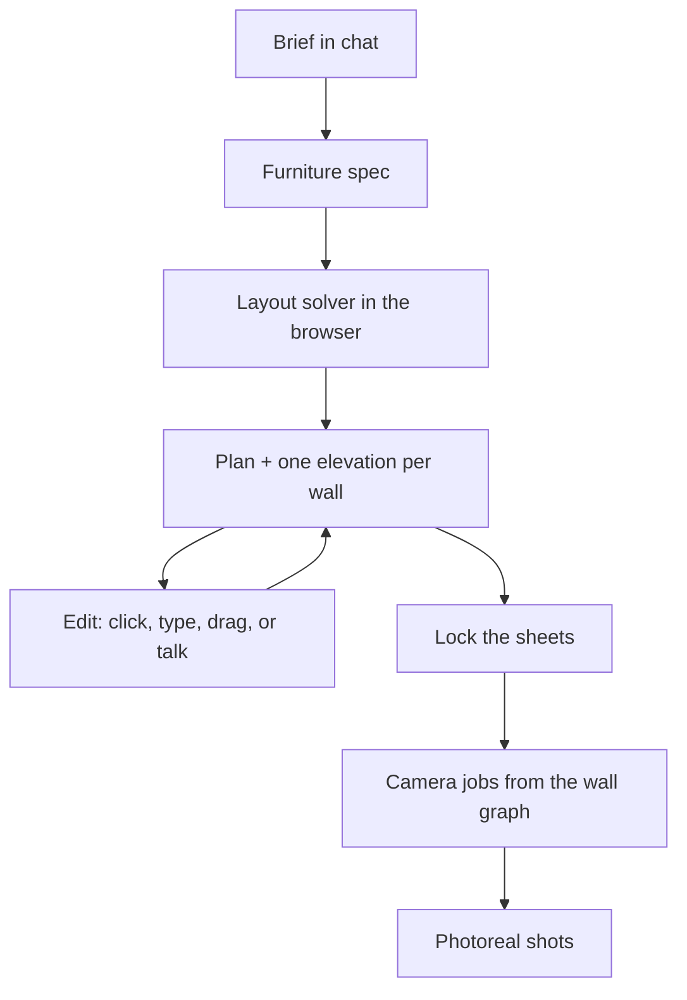

# Interior Designer

> Plans are data. Elevations are data. Renders are pictures.
> Those jobs never share a tool.

This is a local studio for **fitted furniture**. Kitchens, wardrobes, vanities, storage runs, a single cabinet. You describe the piece. A sketch or a photo is welcome, not required. What you get back is a measured floor plan, one front elevation per wall, and, once you lock those drawings, photographs of the walls you actually designed.

The unusual part is not the conversation. Image models are good at rooms that look lived-in and bad at rooms that can be built. Here the furniture is a JSON document. Code lays it out. The browser draws it. Language models collect facts and choose edits. An image model is handed sealed camera jobs of drawings you already approved. It does not get to invent the plan.

## A sitting



1. **Brief.** You talk. You can attach pictures. The intake model asks at most three questions at a time, treats a photo as a crop (what is out of frame is unknown, not absent), and works in centimetres. It cannot mark the brief ready until a typology checklist is filled: answered by you, or recorded as an explicit default. Kitchens, wardrobes, storage, vanities, and free-standing pieces each have their own list. That gate is code, not a plea to “be thorough.”
2. **Drawings.** A second model turns the locked brief into a spec. The browser then solves a plan and one elevation per wall. Wall count comes from the document. Nobody is asked how many sheets to draw.
3. **Edit.** Click a bay, type a size, split a door into a pair, drag a divider, or say it in the chat. Direct manipulation and language emit the same named operations. A chat change is restated, drawn as a ghost on the sheet, and applied only when you confirm. If the model is unsure, it asks. The spec is not rewritten in the dark.
4. **Lock.** The browser rasterises the sheets on screen and uploads those pixels. Those are the references the image model will see.
5. **Photographs.** Optional. One OpenRouter image call per shot, from a packet the planner built. A bad shot is regenerated from the same packet.

There is a **Demo L-kitchen** button on the first screen. It loads a real spec with no API key, so you can read the drawings before you spend a token.

## The spec

One JSON document is the source of truth. If a number is wrong on screen, the spec is wrong, not the picture.

A wall holds bays. A bay is not a flat list of modules. It is an **opening tree**: rows and columns, recursively, the way cabinet software already thinks about carcasses. Children are either a fixed `size_cm` or a `flex` share of whatever remains. Fixed sizes are laid out first; flex fills the rest. A tree therefore always fits its parent. Overflow is not a validation error you hope to catch. It is not expressible.

That is why “two doors next to each other on the top of bay 1” is one operation, not a prompt-engineering problem. The old flat model could not represent side-by-side fronts at all. This one can:

```json
{
  "id": "bay-1",
  "size_cm": 90,
  "split": "rows",
  "children": [
    {
      "id": "row-1",
      "size_cm": 60,
      "split": "cols",
      "children": [
        { "id": "col-0", "flex": 1, "front": { "type": "door", "hinge": "left" } },
        { "id": "col-1", "flex": 1, "front": { "type": "door", "hinge": "right" } }
      ]
    },
    { "id": "row-2", "flex": 1, "front": { "type": "drawer", "count": 3 } }
  ]
}
```

`count` is input shorthand. The server expands it into addressable leaves, so “make the top drawer taller” names a real node. Paths such as `wall-a/bay-1/row-1/col-0` are shared by the drawing, the inspector, and the chat. What you can see, you can say.

Corners are explicit. Where two runs meet, one wall yields its depth so the corner square is counted once. Bay widths are checked against that usable length, not the raw wall length.

An island or peninsula is not a wall unless it has its own designed face.

## How it is drawn

The object lives in centimetres. The sheet lives in millimetres. Those are different spaces.

Sheets are A3 landscape (420 × 297 mm). Scale is snapped to the ISO 5455 ladder (1:1, 1:2, 1:5, 1:10, 1:20, 1:50, 1:100), then centred. A 40 cm nightstand and a 6 m run therefore read as the same drawing set, not as two pictures stretched to fill a box. Lettering follows ISO 3098 (2.5 / 3.5 / 5.0 mm). Line weights follow ISO 128. Annotation does not grow with the furniture. That was the bug that made small pieces look broken: model space and paper space were the same coordinate system.

There is one layout solver, in TypeScript, with no React and no I/O:

- `solveElevation` walks the opening tree, insets fronts by the reveal, and emits dimension bands from the spec.
- `solvePlan` places the wall chain, resolves corners, and ticks the bays.

Hit targets come out of that solve. There is no second layout pass for clicking. Renderers are dumb backends of the same `Sheet`: HTML/CSS in real millimetres for the elevation you edit, SVG for the plan (CSS cannot rotate wall runs), SVG again for export and for the PNGs posted at lock.

## Talking to it

Two language jobs, then one image job. Not a council.

| Job | Model | What it is allowed to do |
| --- | --- | --- |
| Intake | `google/gemini-3.7-flash` | Conversation and vision. Structured brief. Cannot skip the completeness gate. |
| Structure | `openai/gpt-5.6-terra` | Brief → spec. Utterance → operations. Chooses structure. Does not compute coordinates. |
| Photoreal | `google/gemini-3.1-flash-image-preview` | One sealed shot at a time, after lock. |

Edits below a 0.75 confidence, or with any stated ambiguity, become a question. Otherwise you see the change drawn, then you apply it. The server has no endpoint that accepts a spec. Every mutation is an operation: it validates, applies, re-checks invariants, bumps the version, and appends the op log. A rejected op returns why and changes nothing. Undo is that log, sixty steps deep.

All model traffic goes through [OpenRouter](https://openrouter.ai). Cost for the session is shown in the header.

## Photographs

The view planner is ordinary code over the wall graph.

| Layout | Elevations | Shots |
| --- | --- | --- |
| Straight, 1 wall | 1 | 1 frontal |
| L, 2 adjacent | 2 | 1 inside corner |
| U, 3 in a chain | 3 | 2 overlapping corners (A+B, then B+C) |
| Galley, 2 facing | 2 | 2 frontals, never one |
| Four walls | 4 | 2 opposite inside corners |

Rules that are tested, not hoped for: at most two walls per shot, facing walls never paired, every wall appears somewhere, no duplicate wall-sets. Each packet carries only those walls’ elevation PNGs, a plan with that camera cone marked, the locked materials, and an exclude list of every other wall. The image model never sees the whole set at once, and it never decides how many pictures exist.

## Running it

You need Python 3.10 or newer (this tree is exercised on 3.12) and Node 18, 20, or 22+ (Vite 6). Two processes: the API on `127.0.0.1:8000`, the editor on `http://localhost:5173`. Vite proxies `/api`.

```bash
python -m venv .venv
# Windows: .venv\Scripts\activate
source .venv/bin/activate
pip install -r requirements.txt
cp .env.example .env   # Windows: copy .env.example .env
```

Put an `OPENROUTER_API_KEY` in `.env` if you want live intake, spec building, chat edits, or photographs. The demo kitchen and all direct drawing operations work without one.

```bash
python run.py
```

```bash
cd web
npm install
npm run dev
```

Open [http://localhost:5173](http://localhost:5173). Sessions are JSON files under `data/sessions/`.

## Tests

Geometry is pinned in two languages against the same golden files, so the editor and the server cannot quietly disagree about width.

```bash
python -m pytest tests -q          # 229, including migrated build-1 sessions
cd web && npm test                 # 97
cd web && npm run typecheck
```

The TypeScript suite includes property checks on 200 randomly generated specs (no overflow, no sibling gaps, hit targets match boxes) and a readability gate: a nightstand and a six-metre run must pick real ladder scales and keep 2.5 mm dimension text. There is a 21-case edit-agent set in `tests/eval/edit_cases.json`, including the utterance that the previous architecture could not represent. Against a live model:

```bash
python -m scripts.run_edit_eval
```

## Where things live

```
plan.txt                 architecture, with sources
progress.txt             what actually landed, and why
config.py                the two language models and the image model
run.py                   API on 127.0.0.1:8000
app/models/              spec, invariants, ops, paths, migration
app/agents/              intake, structure, strict JSON schemas
app/typology/            maker checklists the gate enforces
app/planner/             elevation jobs and camera jobs
app/render/              sealed photoreal packets
app/editor/              session history, undo, stored sheets
web/src/solver/          the geometry; coordinates are born here
web/src/render/          ElevationDOM, PlanSVG, SheetSVG
web/src/editor/          inspector, chat, lock, gallery
tests/golden/            shared contracts between Python and TypeScript
```

[plan.txt](plan.txt) is the design record. It is long on purpose. [progress.txt](progress.txt) is the lab notebook.

## What this is not

It is furniture-first. You do not draw a building from scratch. Side, rear, and section sheets are not here. Neither are cut lists, DXF, or print-ready PDF, though the opening tree is already the kind of structure a cut list wants. Storage is local JSON, one user, no accounts. This repository is that prototype.

Photoreal needs credits on OpenRouter. The image model can still misread a reference. What it cannot do is choose the geometry, the sheet count, or the camera set.

## Why it is built this way

The short version: instructions such as “be careful with dimensions” and “ask if unclear” are dispositions. They do not hold. Required fields, a sizing rule that cannot overflow, and a planner that emits the shot list do.

The longer version, with the drafting standards, the cabinet-modelling precedent, and the papers on spatial LLM failure and latent ambiguity, is [plan.txt, section 15](plan.txt). Read that if you want the argument as well as the map.
